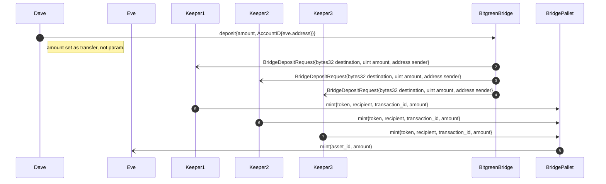
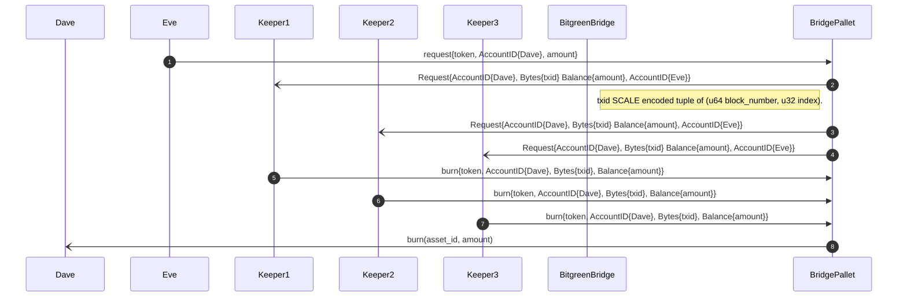
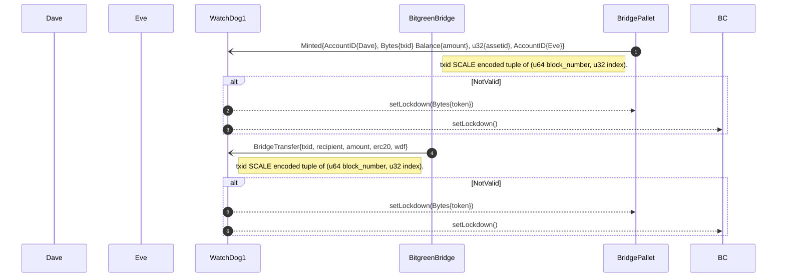

# Bridge

The purpose of the bridge is to allow the cross-chain movement of tokens.

"Bridge" allows to:

- Create/Destroy setting
- Mint/Burn the tokens as assetid in Bitgreen Blockchain accordingly to the request.
- Set lockdown to allow transactions


The pallet is called "Bridge" and below you can find the "Extrinsics" and queries available, ordered by logic of use:  

## Create  Settings

This function allows to create settings of the bridge. It's accessible by SUDO only.
```rust
create_settings(key: Vec<u8>, data: Vec<u8>)
```

This function checks -
1) Lockdown mode is off

where:
- key is the token symbol
- data is JSON object

for example data is:  
{
"chainid":1,
"description":"xxxxxxxxxx",
"address":"5GrwvaEF5zXb26Fz9rcQpDWS57CtERHpNehXCPcNoHGKutQY",
"assetid":1,
"internalthreshold":2,
"externathreshold":2,
"internalkeepers":["5GrwvaEF5zXb26Fz9rcQpDWS57CtERHpNehXCPcNoHGKutQY","5GrwvaEF5zXb26Fz9rcQpDWS57CtERHpNehXCPcNoHGKutQY"],
"externalkeepers":["5GrwvaEF5zXb26Fz9rcQpDWS57CtERHpNehXCPcNoHGKutQY","5GrwvaEF5zXb26Fz9rcQpDWS57CtERHpNehXCPcNoHGKutQY"],
"internalwatchdogs":["5GrwvaEF5zXb26Fz9rcQpDWS57CtERHpNehXCPcNoHGKutQY","5GrwvaEF5zXb26Fz9rcQpDWS57CtERHpNehXCPcNoHGKutQY"],
"externalwatchdogs":["5GrwvaEF5zXb26Fz9rcQpDWS57CtERHpNehXCPcNoHGKutQY","5GrwvaEF5zXb26Fz9rcQpDWS57CtERHpNehXCPcNoHGKutQY"],
"internalwatchcats":["5GrwvaEF5zXb26Fz9rcQpDWS57CtERHpNehXCPcNoHGKutQY","5GrwvaEF5zXb26Fz9rcQpDWS57CtERHpNehXCPcNoHGKutQY"],
"externalwatchcats":["5GrwvaEF5zXb26Fz9rcQpDWS57CtERHpNehXCPcNoHGKutQY","5GrwvaEF5zXb26Fz9rcQpDWS57CtERHpNehXCPcNoHGKutQY"]
}

        
## Query Settings
You can query the settings above calling the function:  
```rust
Settings(key: Vec<u8>)
```
where key is one the key used in the storage.

## Destroy Settings  

This function destroys settings with the given key. It's accessible by SUDO only.

```rust
destroy_settings(key: Vec<u8>)
```
This function checks -
1) Lockdown mode is off

## Mint Tokens

Mint the tokens as assetid in Bitgreen Blockchain accordingly to the request.

```rust
mint(token:Vec<u8>,recipient: T::AccountId, transaction_id:Vec<u8>, amount: Balance)
```

This function checks -
1) Lockdown mode is off
2) Token must be present in the settings
3) The signer must be one of the internalkeepers
4) The signer can confirm only one time
5) The Minting cannot be done 2 times

This function also -
- Stores the mint request
- Stores the mint counter
- Store the minting confirmation when reached the threshold
- Finally, Mint the tokens as assetid in Bitgreen Blockchain accordingly to the request.

@param {Vec<u8>} token - the key once used when calling create_settings, example 'WETH' as Vec<u8>.
@param {T::AccountId} recipient - the AccountId, example //Eve.
@param {Vec<u8>} transaction_id - origin transaction_id used to request crossing the bridge, example '0xddd992ded4b372fed77574951facc635a3e62e7a7b105ef882f2675251406bee' as Vec<u8>.
@param {Balance} amount - requested amount to mint, example '10000' as Balance.

## Burn Tokens

Burn the tokens as assetid in Bitgreen Blockchain accordingly to the request.

```rust
burn(token:Vec<u8>,recipient: T::AccountId, transaction_id:Vec<u8>, amount: Balance)
```

This function checks -
1) Lockdown mode is off
2) Token must be present in the settings
3) The signer must be one of the internalkeepers
4) The signer can confirm only one time
5) The Burning cannot be done 2 times

This function also -
- Stores the burn request
- Stores the burn counter
- Store the burning confirmation when reached the threshold
- Finally, Burn the tokens as assetid in Bitgreen Blockchain accordingly to the request.

@param {Vec<u8>} token - the key once used when calling create_settings, example 'WETH' as Vec<u8>.
@param {T::AccountId} recipient - the AccountId, example //Eve.
@param {Vec<u8>} transaction_id - origin transaction_id used to request crossing the bridge, SCALE encoded tuple of block_number and index, example 'SCALE (100, 2)' as Vec<u8>.
@param {Balance} amount - requested amount to mint, example '10000' as Balance.
## Set Lockdown

This function sets lockdown to true. It's accessible by watchdogs and watch cats only.

```rust
set_lockdown(key: Vec<u8>)
```
This function checks -
1) Setting with given key exists or not

## Set UnLockdown

This function sets lockdown to false. It's accessible by Sudo only.

```rust
set_unlockdown()
```

## Implementation details

### File structure

* evm_bridge.js :

Integration with evm compatible blockchain using web3 js official client

* pallet_bridge.js :

Integration with pallet bridge from BITG substrate based node using the official polkadot js Client

* teleport_evm_pallet.js :

Used for manual testing the implementation by making a request to transfer asset from evm blockchain to pallet BITG

* teleport_pallet_evm.js :

Used for manual testing the implementation by making a request to transfer asset from pallet in BITG to evm blockchain

* setup_test.js :

Used to setup configuration on evm and pallet for running further tests

* keeper.js :

Agent taking part on the bridge process listening to requests and both sides of the bridge and voting for request to cross the bridge or not

* watchdog.js :

Agent taking part on the bridge by doing surveilance of balances on both sides

### Environment variables

* EVM

NODE_ADDRESS - Websocket provider address, example: 'ws://127.0.0.1:8546'
PRIVATE_KEY - Hexadecimal encoded private key used to retrieve keypair used for signing transaction on EVM blockchain, example '0x41c52877d19621b7510636aaa8a6b8c889f3080a161bc4fc86d3b827afb71141'
ROUTER_ADDRESS - Hexadecimal address of deployed BitgreenBridge.sol smart contract on EVM based blockchain, examle '0xa7d64D9B075443010154528D43e1dBd9Cde46786'

* BITG node's pallet bridge

PALLET_MNEMONIC - Substrate based MNEMONIC used to retrieve keypair used for signing transaction on BITG blockchain
BITG_ADDRESS - Websocket provider address, example: 'ws://127.0.0.1:9944'

### Keepers Sequence

* EVM blockchain to BITG node



* BITG node to EVM blockchain



### WatchDog Sequence


