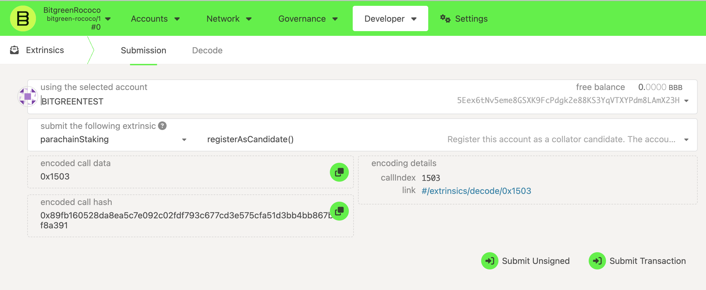

<p align="center">
  
</p>

# Bitgreen Collator Program

This repository contains the core logic and associated tools to issue and manage verified carbon credit units on the Bitgreen parachain.

<!-- TOC -->

- [1. Introduction](#1-introduction)
- [2. Collator Program](#2-overview)
- [3. Prerequisites](#3-prerequisites)
- [4. Installation](#4-installation)
- [5. System Setup](#5-system-setup)
- [6. Run a Collator](#6-run-a-collator)
- [7. Register as Candidate](#7-register-as-candiate)

<!-- /TOC -->

# 1. Introduction
Bitgreen is an open and permissionless blockchain built to meet the needs of NGOs, corporate ESG groups, and purpose-driven innovation in Web3. Bitgreen makes it easy to finance, originate and purchase high quality, transparent Carbon Credits that conserve nature, remove atmospheric CO2 and send financial benefits to local communities.

# 2. Collator Program
Collators aggregate transactions on parachains into blocks and then propose these to the relay chain validators for finalization. Collators do not contribute to network security and only fill the role of a proposer and aggregator. Collators in theory have a power to censor transactions by not including them in their block proposals. 

The Bitgreen network is a parachain and therefore only requires collators, running a collator makes you eligibe for block authoring rewards and inflation rewards. More details of rewards will be updated later.

# 3. Prerequisites

:warning: **Running a validator on a live network is a lot of responsibility! You will be accountable for not only your own stake, but also the stake of your current nominators. If you make a mistake and get slashed, your money and your reputation will be at risk. However, running a validator can also be very rewarding, knowing that you contribute to the security of a decentralized network while growing your stash. It is highly recommended that you have significant system administration experience before attempting to run your own validator. You must be able to handle technical issues and anomalies with your node which you must be able to tackle yourself. Being a validator involves more than just executing the Bitgreen binary.**

### Requirements
The most common way for a beginner to run a validator is on a cloud server running Linux. You may choose whatever VPS provider that your prefer. As OS it is best to use a recent Debian Linux. For this guide we will be using Ubuntu 22.04, but the instructions should be similar for other platforms.

### Reference Hardware
The transaction weights in Polkadot are benchmarked on reference hardware. We ran the benchmark on VM instances of two major cloud providers: Google Cloud Platform (GCP) and Amazon Web Services (AWS). To be specific, we used c2d-highcpu-8 VM instance on GCP and c6id.2xlarge on AWS. It is recommended that the hardware used to run the validators at least matches the specs of the reference hardware in order to ensure they are able to process all blocks in time. If you use subpar hardware you will possibly run into performance issues, get less era points, and potentially even get slashed.

#### CPU
x86-64 compatible;
Intel Ice Lake, or newer (Xeon or Core series); AMD Zen3, or newer (EPYC or Ryzen);
4 physical cores @ 3.4GHz;
Simultaneous multithreading disabled (Hyper-Threading on Intel, SMT on AMD);
Prefer single-threaded performance over higher cores count. A comparison of single-threaded performance can be found here.

#### Storage
An NVMe SSD of 1 TB (As it should be reasonably sized to deal with blockchain growth). An estimation of current chain snapshot sizes can be found here. In general, the latency is more important than the throughput.

#### Memory
16GB DDR4 ECC.
System
Linux Kernel 5.16 or newer.

#### Network
The minimum symmetric networking speed is set to 500 Mbit/s (= 62.5 MB/s). This is required to support a large number of parachains and allow for proper congestion control in busy network situations.
The specs posted above are not a hard requirement to run a validator, but are considered best practice. Running a validator is a responsible task; using professional hardware is a must in any way.


# 4. Installation

Once you choose your cloud service provider and set-up your new server, the first thing you will do is install Rust.

If you have never installed Rust, you should do this first.

If you have already installed Rust, run the following command to make sure you are using the latest version.

```rustup update```

If not, this command will fetch the latest version of Rust and install it.

```
curl https://sh.rustup.rs -sSf | sh -s -- -y
```

NOTE
If you do not have "curl" installed, run:

```bash
sudo apt install curl
```

It will also be valuable to have "websocat" (Netcat, curl and socat for WebSockets) installed for RPC interactions. Installation instructions for various operating systems can be found here.

To configure your shell, run the following command.

```bash
source $HOME/.cargo/env
```

Verify your installation.

```bash
rustc --version
```

Finally, run this command to install the necessary dependencies for compiling and running the Polkadot node software.

```bash
sudo apt install make clang pkg-config libssl-dev build-essential
```

Note - if you are using OSX and you have Homebrew installed, you can issue the following equivalent command INSTEAD of the previous one:

```bash
brew install cmake pkg-config openssl git llvm
```

#### Install & Configure Network Time Protocol (NTP) Client

NTP is a networking protocol designed to synchronize the clocks of computers over a network. NTP allows you to synchronize the clocks of all the systems within the network. Currently it is required that validators' local clocks stay reasonably in sync, so you should be running NTP or a similar service. You can check whether you have the NTP client by running:

If you are using Ubuntu 18.04 or a newer version, NTP Client should be installed by default.

```timedatectl```

If NTP is installed and running, you should see System clock synchronized: yes (or a similar message). If you do not see it, you can install it by executing:

```bash
sudo apt-get install ntp
```

ntpd will be started automatically after install. You can query ntpd for status information to verify that everything is working:

```bash
sudo ntpq -p
```

# 5. System Setup

This guide focuses on running the node as a systemd service. 

### Build the binary
Once you have all prerequisites installed, clone and build the bitgreen binary

```sh
git clone https://github.com/bitgreen/bitgreen-node
cd bitgreen-node
```

Checkout the current active version

```
git checkout <current-active-tag>
```

Build the release binary for the parachain 

```
cargo build --release -p bitgreen-parachain
```

### Generate node key

To generate a node key, run

```bash
./bitgreen-parachain key generate-node-key --file <location-of-nodekey-file>
```

### Setup service

To setup the systemd service, first create the file using 

```bash
sudo nano /etc/systemd/system/bitgreen.service
```

Copy the following config, making the required path changes for your setup

```bash
[Unit]
Description=Bitgreen Collator
After=network-online.target
StartLimitIntervalSec=0

[Service]
User=bitgreen_service
Restart=always
Restart=on-failure
SyslogIdentifier=bitgreen
RestartSec=3
StandardOutput=file:/root/logs/parachain
StandardError=file:/root/logs/parachain_err
ExecStart=/var/lib/bitgreen-parachain \
  --chain <location-of-chainspec-file> \
  --collator --force-authoring --base-path <location-of-basepath> --port 40333 \
  --node-key-file <location-of-nodekey-file> \
  --rpc-cors all --ws-external \
  --ws-port 9944 --rpc-port 9933 \
  --name "YOUR-NODE-NAME" \
  --rpc-methods=unsafe -- --execution wasm --chain <location-of-relaychain-chainspec>

[Install]
WantedBy=multi-user.target
```

# 6. Run a Collator

If this is the first time starting a collator, remember to insert the keys before starting the collator, to insert keys run

```bash
./bitgreen-parachain key insert --base-path <location-of-basepath> \
--chain <location-of-chainspec> \
--scheme Sr25519 \
--suri "YOUR_SECRET_KEY" \
--key-type aura
```

Start the collator binary and wait for it to sync with the chain state

Register and start the service by running:

```bash
systemctl enable bitgreen.service
systemctl start bitgreen.service
```

And lastly, verify the service is running:
```bash
systemctl status bitgreen.service
```


# 7. Register as Candidate

Ensure the collator is working correctly and has synced up with both the relaychain and parachain latest heads, once the collator has caught up and is ready to produce blocks, you have to add your collator keys to the parachain staking pallet to be considered as a candidate.

Head to `https://polkadot.js.org/apps/?rpc=wss%3A%2F%2Ftestnet.bitgreen.org#/extrinsics`

Select parachainStaking -> register as candidate, make sure to use the same account that you used to start the collator.



Once the extrinsic is succesful, depending on your staked amount, you have a chance to be selected as a block author for next session.