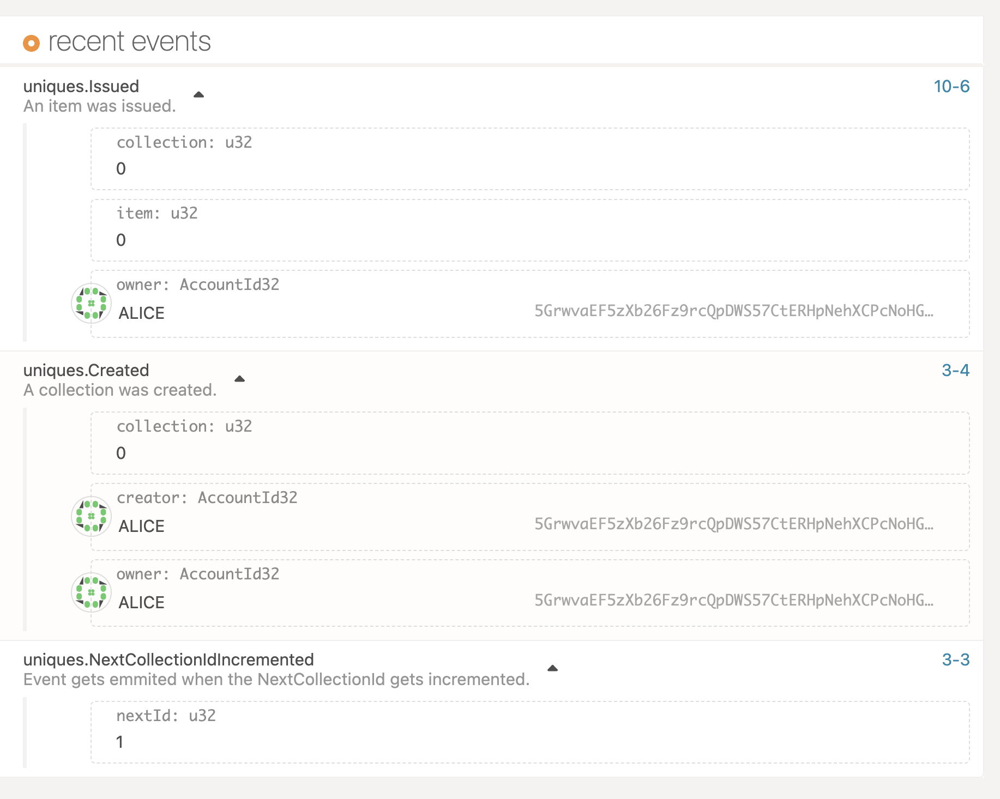
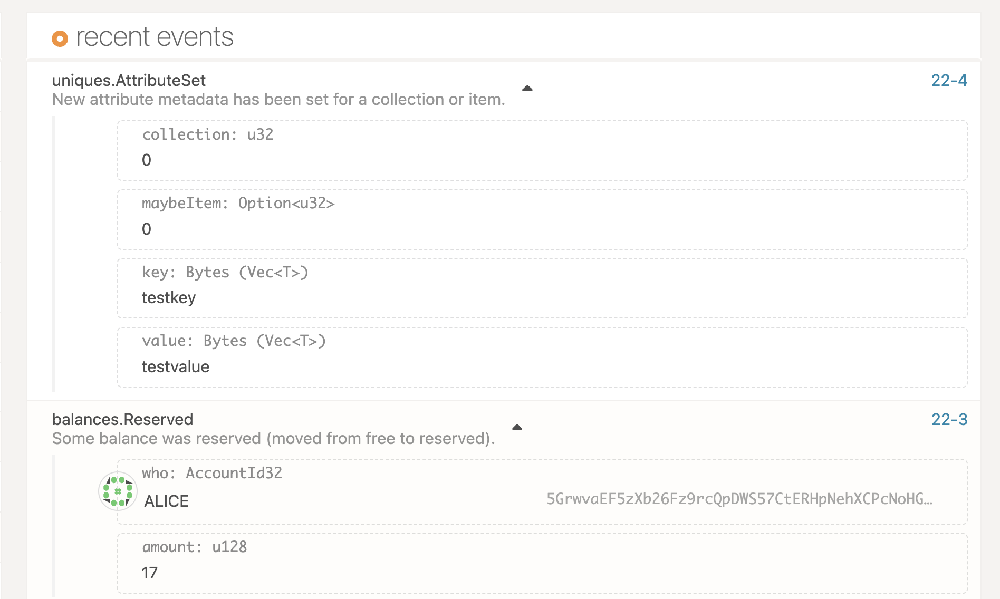

# Bitgreen : Pallet Uniques Guide

The uniques pallet is part of the substrate FRAME module and allows to create, destroy and manage non fungible assets on chain.

## Overview

The Uniques module provides functionality for asset management of non-fungible asset classes, including:

* Asset Issuance
* Asset Transfer
* Asset Destruction

### Terminology

* **Asset issuance:** The creation of a new asset instance.
* **Asset transfer:** The action of transferring an asset instance from one account to another.
* **Asset burning:** The destruction of an asset instance.
* **Non-fungible asset:** An asset for which each unit has unique characteristics. There is exactly
  one instance of such an asset in existence and there is exactly one owning account.
* **Class** : Represents a common type of asset, usually called Collection
* **Instance** : Represents a single asset instance, an instance exists within a class


### Goals

The Uniques pallet in Substrate is designed to make the following possible:

* Allow accounts to permissionlessly create asset classes (collections of asset instances).
* Allow a named (permissioned) account to mint and burn unique assets within a class.
* Move asset instances between accounts permissionlessly.
* Allow a named (permissioned) account to freeze and unfreeze unique assets within a
  class or the entire class.
* Allow the owner of an asset instance to delegate the ability to transfer the asset to some
  named third-party.

## Interface

### Permissionless dispatchables
* `create`: Create a new asset class by placing a deposit.
* `transfer`: Transfer an asset instance to a new owner.
* `redeposit`: Update the deposit amount of an asset instance, potentially freeing funds.
* `approve_transfer`: Name a delegate who may authorise a transfer.
* `cancel_approval`: Revert the effects of a previous `approve_transfer`.

### Permissioned dispatchables
* `destroy`: Destroy an asset class.
* `mint`: Mint a new asset instance within an asset class.
* `burn`: Burn an asset instance within an asset class.
* `freeze`: Prevent an individual asset from being transferred.
* `thaw`: Revert the effects of a previous `freeze`.
* `freeze_class`: Prevent all asset within a class from being transferred.
* `thaw_class`: Revert the effects of a previous `freeze_class`.
* `transfer_ownership`: Alter the owner of an asset class, moving all associated deposits.
* `set_team`: Alter the permissioned accounts of an asset class.

### Metadata (permissioned) dispatchables
* `set_attribute`: Set a metadata attribute of an asset instance or class.
* `clear_attribute`: Remove a metadata attribute of an asset instance or class.
* `set_metadata`: Set general metadata of an asset instance.
* `clear_metadata`: Remove general metadata of an asset instance.
* `set_class_metadata`: Set general metadata of an asset class.
* `clear_class_metadata`: Remove general metadata of an asset class.

### Force (i.e. governance) dispatchables
* `force_create`: Create a new asset class.
* `force_asset_status`: Alter the underlying characteristics of an asset class.

## Examples

* Create an NFT in bitgreen parachain

  Note : for the sake of example, this snippet uses a test account alice, the best practice is to handle signing from a wallet

```javascript
    // Using test account alice
    const ALICE = '5GrwvaEF5zXb26Fz9rcQpDWS57CtERHpNehXCPcNoHGKutQY';

    // Create an asset class, with ALICE as admin
    const create_class = api.tx.uniques.create(ALICE);

    // Sign and Send the transaction
    await create_class.signAndSend(ALICE, ({ events = [], status }) => {
        if (status.isInBlock) {
            console.log('Successful creation of class with hash ' + status.asInBlock.toHex());
        } else {
            console.log('Status of transaction: ' + status.type);
        }

        events.forEach(({ phase, event: { data, method, section } }) => {
            console.log(phase.toString() + ' : ' + section + '.' + method + ' ' + data.toString());
        });
    });


    // create an instance belonging to that class
    const mint_instance = api.tx.uniques.mint(1, 1, ALICE);

    // Sign and Send the transaction
    await mint_instance.signAndSend(ALICE, ({ events = [], status }) => {
        if (status.isInBlock) {
            console.log('Successful mint of instance with hash ' + status.asInBlock.toHex());
        } else {
            console.log('Status of transaction: ' + status.type);
        }

        events.forEach(({ phase, event: { data, method, section } }) => {
            console.log(phase.toString() + ' : ' + section + '.' + method + ' ' + data.toString());
        });
    });
```

On succesful execution you should be able to observe the following events on the explorer




* Set attributes for an instance (token)

  Note : for the sake of example, this snippet uses a test account alice, the best practice is to handle signing from a wallet

```javascript
    // Using test account alice for simplicity
    const ALICE = '5GrwvaEF5zXb26Fz9rcQpDWS57CtERHpNehXCPcNoHGKutQY';

    // Create an asset class, with ALICE as admin
    let class_id = 0;
    let instance_id = 0;
    const create_class = api.tx.uniques.setAttribute(class_id, instance_id, "testkey", "testvalue");

    // Sign and Send the transaction
    await create_class.signAndSend(ALICE, ({ events = [], status }) => {
        if (status.isInBlock) {
            console.log('Successful creation of class with hash ' + status.asInBlock.toHex());
        } else {
            console.log('Status of transaction: ' + status.type);
        }

        events.forEach(({ phase, event: { data, method, section } }) => {
            console.log(phase.toString() + ' : ' + section + '.' + method + ' ' + data.toString());
        });
    });
```

On succesful execution you should be able to observe the following events on the explorer

