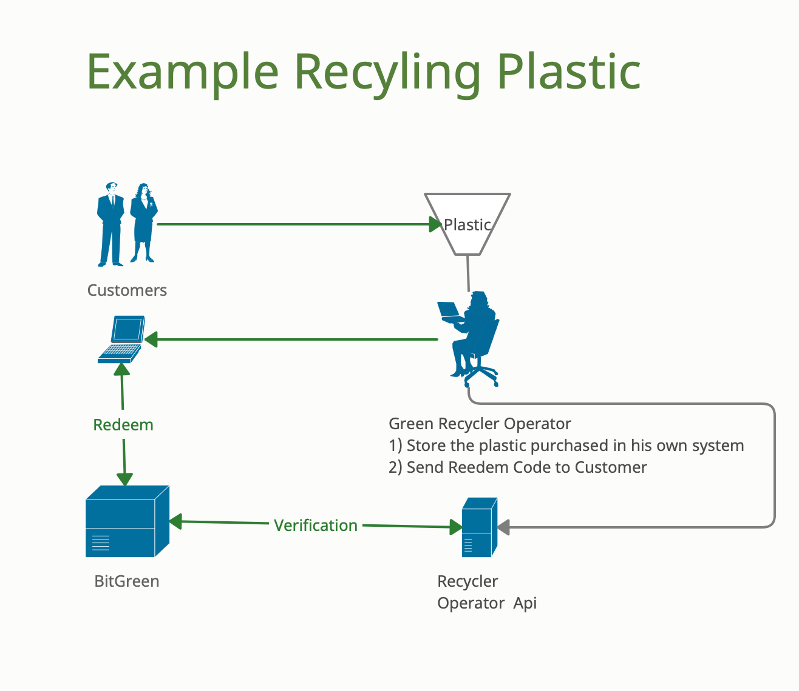

# ORACLES
Blockchain oracles are third-party services that provide smart contracts with external information. They serve as bridges between blockchains and the outside world.
Blockchains and smart contracts cannot access off-chain data (data that is outside of the network). However, for many contractual agreements, it is vital to have relevant information from the outside world to execute the agreement. 
This is where blockchain oracles come into play, as they provide a link between off-chain and on-chain data. Oracles are vital within the blockchain ecosystem because they broaden the scope in which smart contracts can operate. Without blockchain oracles, smart contracts would have very limited use as they would only have access to data from within their networks.  
  
It’s important to note that a blockchain oracle is not the data source itself, but rather the layer that queries, verifies, and authenticates external data sources and then relays that information. The data transmitted by oracles comes in many forms – price information, the successful completion of a payment, or the temperature measured by a sensor.  
  
To call data from the outside world, the smart contract has to be invoked, and network resources have to be spent. Some oracles also have the ability to not only relay information to smart contracts but to send it back to external sources.  
  
Many different types of oracles exist – how a blockchain oracle operates is entirely dependent on what it is designed for. This article will go through some of those designs.  
  
## Oracle for Impact Actions
We prepared a ready to go Oracle to be used for "Impact Actions" in the scenario of the design below:


"bitg-oracel-impact-actons-server.sh" is  the bash script (for Linux OS), used to launch such Oracle

## Requirements:
- [Nodejs >= 14.x](https://nodejs.dev)
- [Yarn >= 1.22](https://classic.yarnpkg.com)  


## Installation
You should install the required libraries using npn (part of nodejs package):  
```sh
npm install express
yarn add  @polkadot/api
yarn add  @polkadot/keyring
```
Customize the starting script:
customise the script: bitg-oracle-impact-action.sh settings the variables to access as from your configuration and execute:  
```sh
bitg-oracle-impact-actions.sh
```

To enable HTTPS you should install the private key and certificate from a well recognised Certification Authority.  
In the example we used: [https://certbot.eff.org](https://certbot.eff.org).  
And you should set the accordingly environment variables in "bitg-oracle-impact-action.sh" to point to the correct file name.  

## Run
```sh
./bitg-oracle-impact-actions.sh
```

