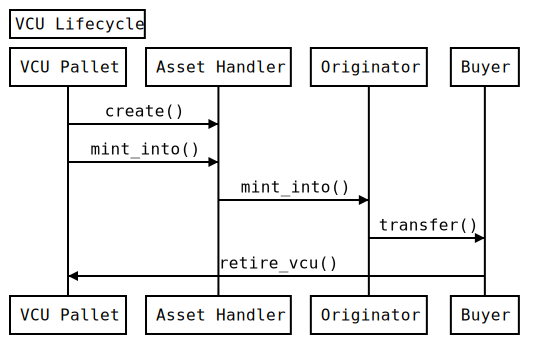

# VCU Pallet

The VCU pallet manages the creation and retirement of VCU units for the bitgreen runtime.

### Background on VCUs

Under the VCS Program, projects are issued unique carbon credits known as Verified Carbon Units or VCUs. Each VCU represents a reduction or removal of one tonne of carbon dioxide equivalent (CO2e) achieved by a project. VCUs are characterized by a number of quality assurance principles which are confirmed through the project validation and verification process. VCUs are ultimately purchased and retired by an end user as a means of offsetting their emissions. All VCU issuance and retirement records are publicly available on the [Verra Registry](https://registry.verra.org/).

### OnChain Representation

The VCU pallet creates and retires VCU units that represent the VCUs on the Verra registry. These onchain vcu units can represent a single type of VCU or can build to represent a combination of different types of VCUs.  The VCUs are represented onchain as follows:

```rust
/// The VCUDetails as stored in pallet storage
#[derive(Clone, Encode, Decode, Eq, PartialEq, Debug, TypeInfo, MaxEncodedLen)]
#[cfg_attr(feature = "serde", derive(serde::Serialize, serde::Deserialize))]
pub struct VCUDetail<AccountId, Balance, AssetId, BundleList> {
    /// The account that owns/controls the VCU class
    pub originator: AccountId,
    /// Count of current active units of VCU
    pub supply: Balance,
    /// Count of retired units of VCU
    pub retired: Balance,
    /// The AssetId that represents the Fungible class of VCU
    pub asset_id: AssetId,
    /// The type of VCU [Bundle, Single]
    pub vcu_type: VCUType<BundleList>,
}
```

### Example Workflow

The VCU units are created by an account that controls VCU units on the Verra registry, represented in the pallet as the originator. The creation process will store the VCU details on the pallet storage and then mint the given amount of Vcu units using the Asset Handler like pallet-assets. These newly minted vcu units will be transferred to the recipient, this can be any address (for simplicity lets assume its the originator address). These units can then be sold/transferred to a buyer of carbon credits, these transactions can take place multiple times but the final goal of purchasing a Vcu unit is to retire them. The current holder of the vcu units can call the `retire_vcu` extrinsic to burn these tokens (erase from storage), this process will store a reference of the tokens burned.



### Asset Handler

The VCU pallet depends a fungible asset handler that implements the fungibles trait like pallet-assets. The VCU pallet creates an AssetClass for each `vcu_id` and mints the amount of tokens to the respective account. The `asset_id` in the VCUDetail represents the asset created by the Asset Handler.

We also rely on the Asset Handler to help the user manage these tokens, currently the user can only transfer these tokens, the other functions like burn/mint are gated to only be performed by the vcu pallet, this is to ensure the retired and supply count is always updated.


### Extrinsics

- `add_authorized_account(origin: OriginFor<T>,account_id: T::AccountId)`

	This extrinsic allows the Root to add a new authorised account to the list of permitted origins. Only authorised accounts are permitted to create new VCU units, this is to ensure the validity of VCU units.

- `remove_authorized_account(origin: OriginFor<T>,account_id: T::AccountId)`

	This extrinsic allows the Root to remove an authorised account from the list of permitted origins.
- `create_vcu(origin: OriginFor<T>,project_id: ProjectId,params: VCUCreationParamsOf<T>)`

	The create_vcu extrinsic performs three main functions,
	1. Create a project/vcu entry in the pallet storage
	2. Create an Asset Class with the originator as the admin
	3. Mint amount of Asset (vcus) to the recipient account

	The input params is expected in the below format :

```rust
/// The input params for creating a new VCU
#[derive(Clone, Encode, Decode, Eq, PartialEq, Debug, TypeInfo, MaxEncodedLen)]
#[cfg_attr(feature = "serde", derive(serde::Serialize, serde::Deserialize))]
pub struct VCUCreationParams<AccountId, Balance, BundleList> {
    /// The type of VCU used [Single, Bundle]
    pub vcu_type: VCUType<BundleList>,
    /// The account that owns/controls the VCU class
    pub originator: AccountId,
    /// The amount of VCU units to create
    pub amount: Balance,
    /// The account that receives the amount of VCU units
    pub recipient: AccountId,
}

/// The types of VcuId, VCUs can be created from one single type or can be a mix
/// of multiple different types called a Bundle
#[derive(Clone, Encode, Decode, Eq, PartialEq, Debug, TypeInfo, MaxEncodedLen)]
#[cfg_attr(feature = "serde", derive(serde::Serialize, serde::Deserialize))]
pub enum VCUType<BundleList> {
    /// Represents a list of different types of VCU units
    Bundle(BundleList),
    /// Represents a single type
    Single(u32),
}
```

- `retire_vcu(origin: OriginFor<T>, project_id: ProjectId,vcu_id: VcuId, amount: T::Balance)`

	The retire vcu will burn the VCU units and update the `retired` field of the VCUDetail storage. It also stores the details in the RetiredVCUs storage.
